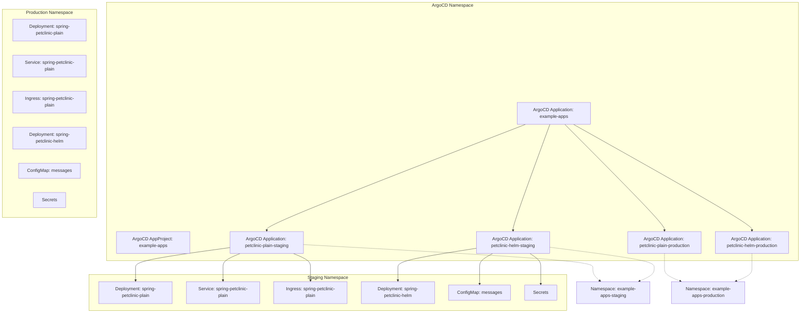
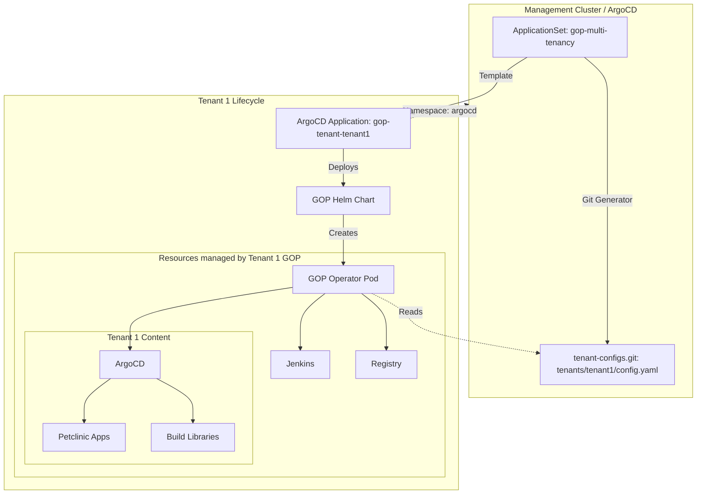

# GitOps Examples

This repository serves as a direct companion to the [GitOps Playground](https://github.com/cloudogu/gitops-playground) from Cloudogu. It contains example configurations to test and showcase 

## What will you find here?

In this repo, we collect various templates and configurations tailored to be used with the gitops-playground. Typically this includes:

* configurations for gop features
* example Jenkins Pipelines
* multi-tenant gop configurations

## What does each example do?

### example-apps-via-content-loader

### init-multi-tenancy

## Useful Links
* [GitOps Playground Repository](https://github.com/cloudogu/gitops-playground)
* [Cloudogu Website](https://cloudogu.com/)
